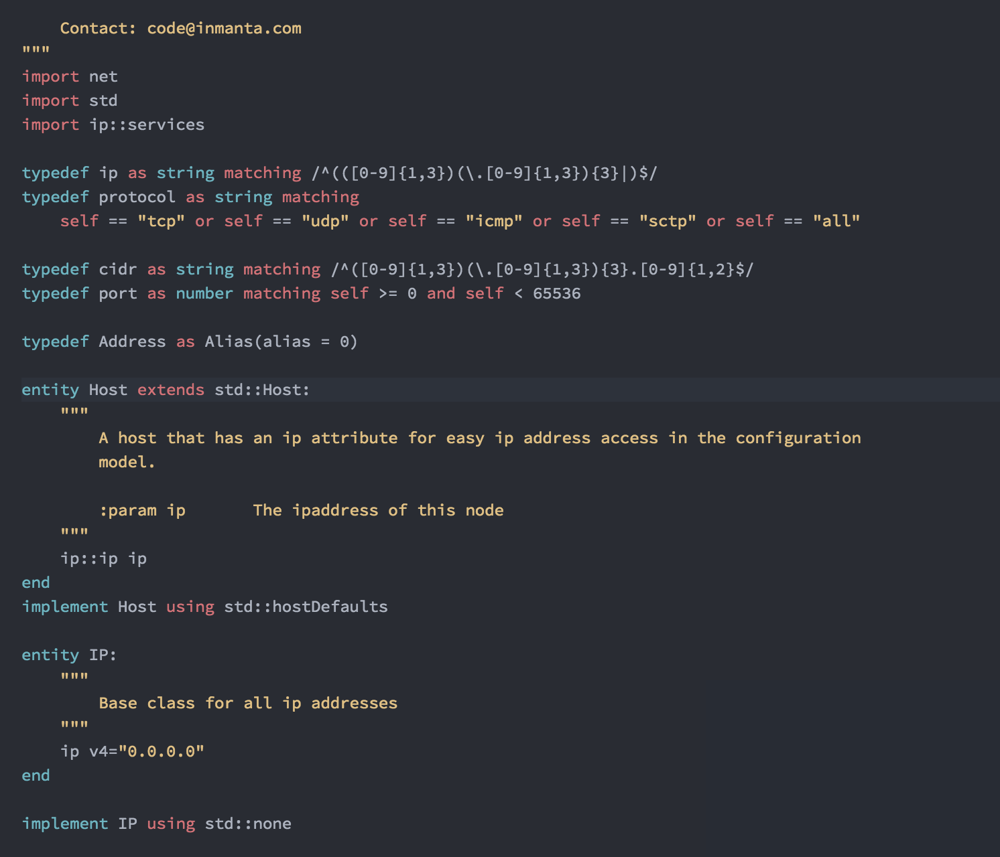
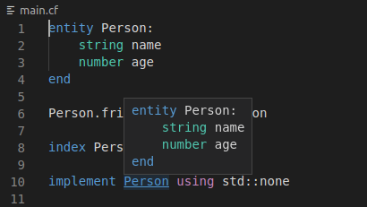
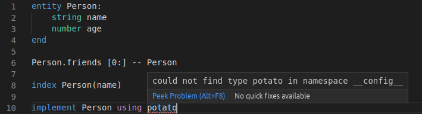
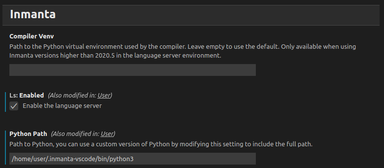
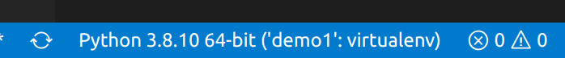
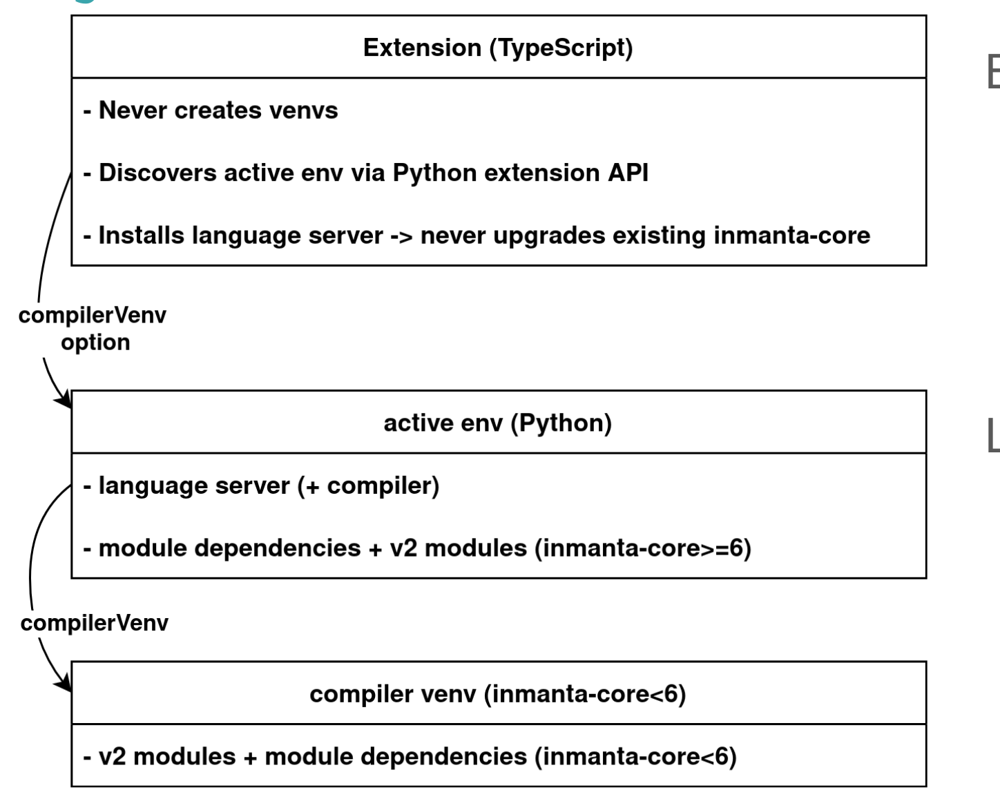

# Inmanta README

This is a [Microsoft Visual Code](https://code.visualstudio.com/) plugin for [Inmanta](https://inmanta.com/)

Eliminate Complexity.

End-to-end orchestration of applications and networks.

Inmanta Documentation on [Read the Docs](https://inmanta.com/resources/docs/)

## Features


### Syntax highlighting
The extension makes your life easier by highlighting syntax keywords or the Inmanta language.



### Code navigation
When you hover an element while pressing `Ctrl`, an overview of its Entity type is shown. If you click it (while still having `Ctrl` pressed) you can navigate to the definition of the entity.

> :bulb: To work properly, this feature requires the Inmanta Language Server to be running:
> In the inmanta extension configuration (`ctrl+, > extensions > inmanta`), ensure that `LS` is enabled.



### Compilation error reporting
The extension will run a pre-compilation every time you save your file. Making it easier for you to spot syntax and basic model errors. When hovering the problematic bit, an explaination message is shown, and more details can be found in the **Output** panel (when selecting *Inmanta Server Language* in the expandable list on the right).

> :bulb: To work properly, this feature requires the Inmanta Language Server to be running:
> In the inmanta extension configuration (`ctrl+, > extensions > inmanta`), ensure that `LS` is enabled.



### Model export
The extension adds a button in the upper right corner of the editing panel of any inmanta model file (ending in `.cf`): **Export to server**. This buttons allows you to easily export the currently opened model to a running Inmanta server. Note that for this to work, you need to have previously configured the server and added the following in the `.inmanta` configuration file at the root of the project:

```
[config]
environment=f2f6ac46-10a2-4e75-897d-b91c51c78df2  # Replace this by the right environment uuid

[compiler_rest_transport]
host=10.0.0.102                                   # Replace this by the address of the host
port=8888                                         # Replace this by the port on which the server is listening

[cmdline_rest_transport]
host=10.0.0.102                                   # Replace this by the address of the host
port=8888                                         # Replace this by the port on which the server is listening
```

## Requirements

 - Operating System: Currently only Linux and Windows are supported.
 - Python extension (ms-python.python) installed
 - Python >=3.6 <=3.8

## Extension Settings

You can find the settings of the extension, in the Settings panel, under `Extensions > Inmanta`.



The extension currently has three settings:
 - inmanta.compilerVenv: Absolute path to the virtual environment the compiler and language server should use.
 - inmanta.ls.enabled: Whether or not activate the Inmanta Language server (you probably want to).
 - inmanta.repos: A yaml list of repositories to tell the Inmanta extension where to look for modules. This setting is only used when working on a module.


### Python environments
The plugin uses the Python extension to change environments. This can be done by clicking on the active environment in the bottombar
and then selecting the environment to activate.

Please use the default setting for "python.interpreter.infoVisibility": "OnPythonRelated".



The selected Python environment will be used to install the Inmanta Language server.
 - If the used version of inmanta-core>=6 then it will also be used for the module dependencies and the v2 modules.
 - If the version of inmanta-core<6 then the inmanta.compilerVenv setting will be used as environment for the module dependencies.



## Known Issues

The Python extension sometimes crashes when opening an untrusted workspace for the first time. A workaround to this issue is to restart VS Code. See related discussion [here](https://github.com/microsoft/vscode-python/issues/20367).

## Troubleshooting

### No module named x

If compilation fails with the message "no module named x" where x is a Python module, you might need to clean up the virtual
environments used by the compiler. This issue can be caused when you open a project in vscode that you previously compiled
manually, or when you change the path for the language server venv. To clean up the virtual environments, remove the .env
directory in the Inmanta project directory as well as the directory specified in the Compiler Venv option in the extension's
settings. Then restart vscode.

## Development tests

If you are contributing or developing for the extention, here are the steps required to run the E2E tests.

- `npm install`
- Make certain you are running the correct python version. 3.12 or higher is required. 
    - If you are on WSL-Ubuntu and have issues updating your python version, you can try the following: 
        - `sudo add-apt-repository ppa:deadsnakes/ppa`
        - `sudo apt install python3.12`
- `python3.12 -m venv /tmp/venv`
- `export INMANTA_EXTENSION_TEST_ENV=/tmp/venv`
- `export INMANTA_LS_LOG_PATH=/tmp/venv/server.log`
- `export DISPLAY=:0` (only for Windows/WSL)
- `/tmp/venv/bin/python -m pip install ./server`

You can now launch the tests either with the debugger, or with `npm run test`.

## Authors

- Frank Rosquin
- Inmanta

## Release Notes

### 0.2

Syntax updates and publish in marketplace

### 0.0.1

Initial release

**Enjoy!**
