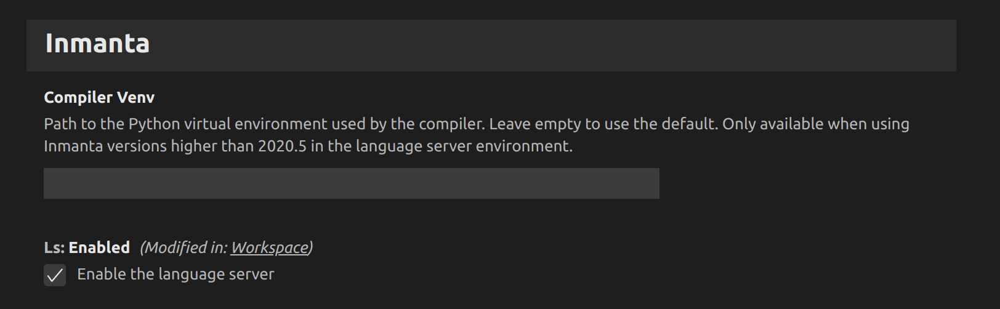

# Inmanta README

This is a [Microsoft Visual Code](https://code.visualstudio.com/) plugin for [Inmanta](https://inmanta.com/)

Eliminate Complexity.

End-to-end orchestration of applications and networks.

Inmanta Documentation on [Read the Docs](https://inmanta.com/resources/docs/)

## Features


### Syntax highlighting
The extension makes your life easier by highlighting syntax keywords or the Inmanta language.


### Code navigation
When pressing on `Ctrl` and hovering an element, and overview of its type Entity is shown.  If you click on it (while still having `Ctrl` pressed on) you can navigate to the definition of the entity.

> :bulb: To work properly, this feature requires the Inmanta Language Server to be running:  
> In the inmanta extension configuration (`ctrl+, > extensions > inmanta`), set `LS`: to Enabled


### Compilation error reporting
The extension will run a pre-compilation every time you save your file.  Making it easier for you to spot syntax and basic model errors.  When hovering the problematic bit, an explaination message is shown, and more details can be found in the **Output** panel (when selecting *Inmanta Server Language* in the expandable list on the right).

> :bulb: To work properly, this feature requires the Inmanta Language Server to be running:  
> In the inmanta extension configuration (`ctrl+, > extensions > inmanta`), set `LS`: to Enabled


### Model export
The extension adds a button in the upper right corner of the editing panel of any inmanta model file (ending in `.cf`): **Export to server**.  This buttons allows you to easily export the currently opened model to a running Inmanta server.  Note that for this to work, you need to have previously configured the server and added the following in the `.inmanta` configuration file at the root of the project:

```
[config]
environment=f2f6ac46-10a2-4e75-897d-b91c51c78df2  # Replace this by the right environment uuid

[compiler_rest_transport]
host=10.0.0.102                                   # Replace this by the address of the host
port=8888                                         # Replace this by the port on which the server is listening

[cmdline_rest_transport]
host=10.0.0.102                                   # Replace this by the address of the host
port=8888                                         # Replace this by the port on which the server is listening
```

## Requirements

None

## Extension Settings

You can find the settings of the extension, in the Settings panel, under `Extensions > Inmanta`.



The extension currently has three settings:
 - inmanta.compilerVenv: Absolute path to the virtual environment the compiler should use.
 - inmanta.ls.enabled: Whether or not activate the Inmanta Language server (you probably want to).
 - inmanta.pythonPath: Python path the extension should use to run the language server.

## Known Issues

None ATM

## Authors

- Frank Rosquin
- Inmanta

## Release Notes

### 0.2

Syntax updates and publish in marketplace

### 0.0.1

Initial release

**Enjoy!**
