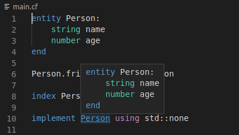

### Syntax highlighting

The extension makes your life easier by highlighting syntax keywords of the Inmanta language.

### Code navigation

When you hover an element while pressing `Ctrl`, an overview of its Entity type is shown. If you click it (while still having `Ctrl` pressed) you can navigate to the definition of the entity.

### Compilation error reporting

The extension will run a pre-compilation every time you save your file. Making it easier for you to spot syntax and basic model errors. When hovering the problematic bit, an explanation message is shown, and more details can be found in the **Output** panel (when selecting _Inmanta Server Language_ in the expandable list on the right).

